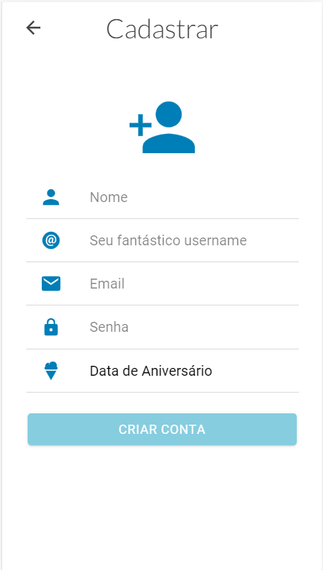
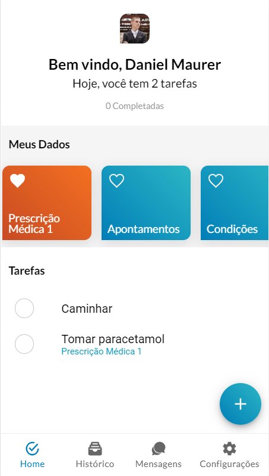
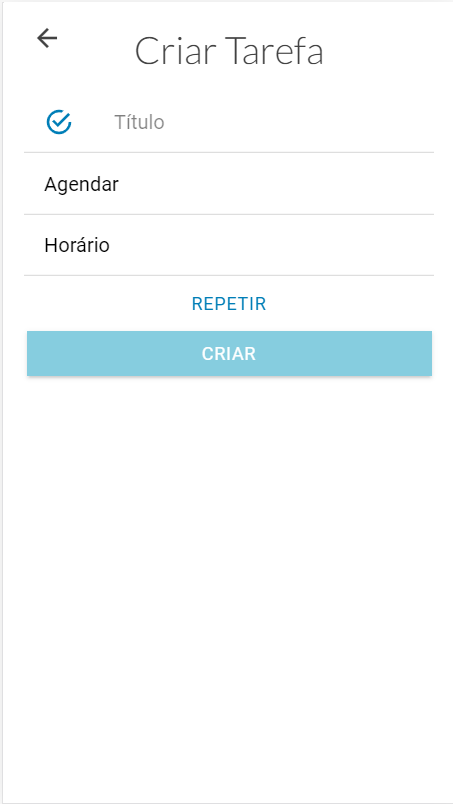
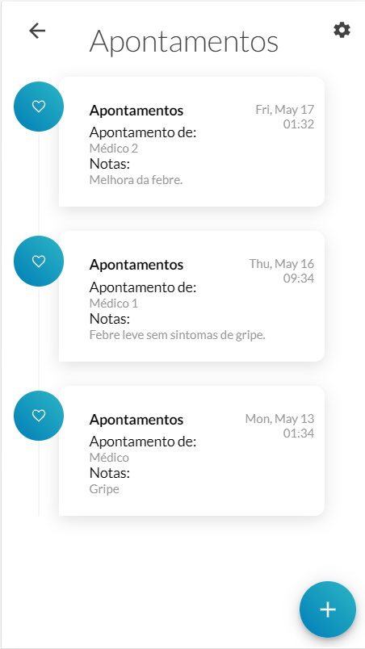
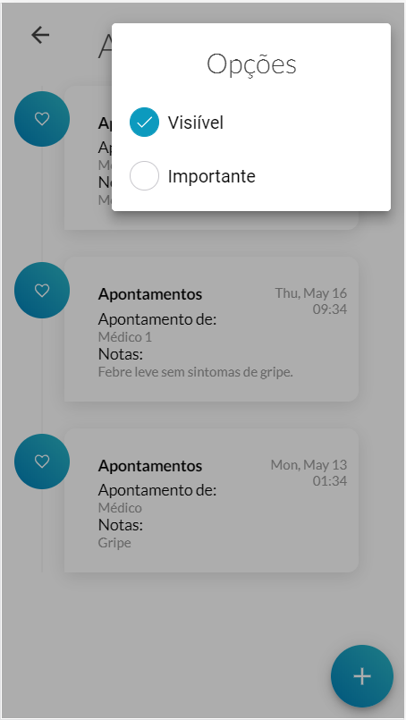
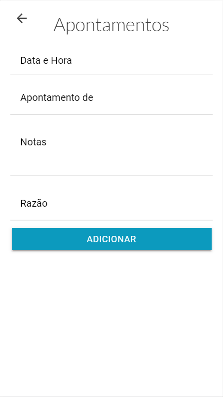
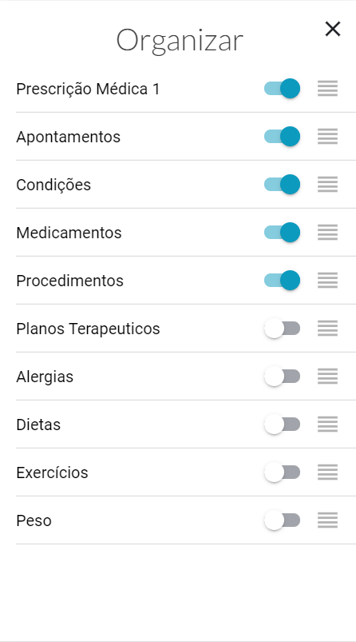
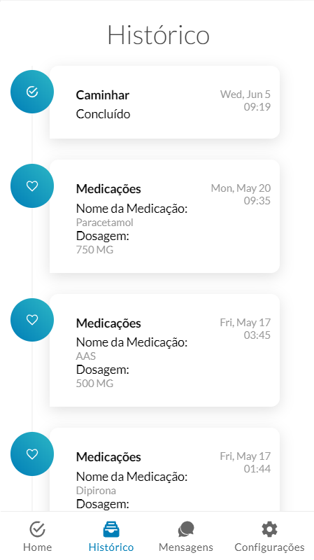
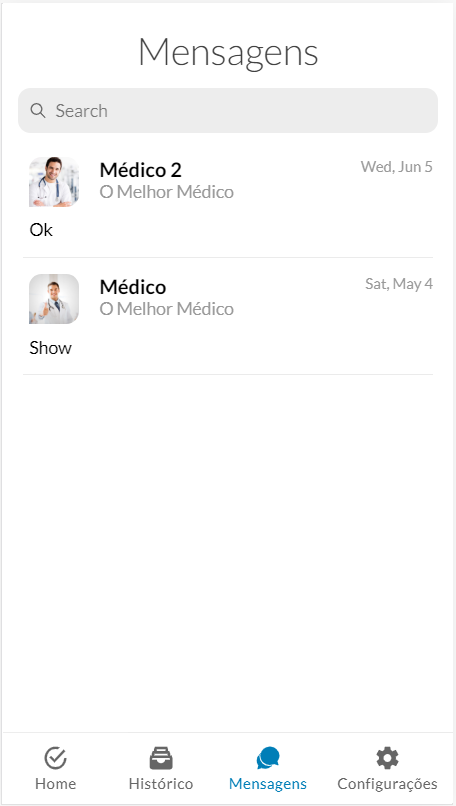
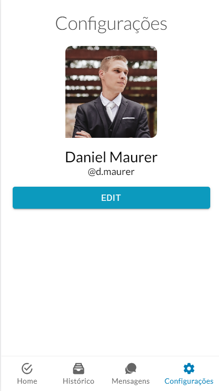

# MyHealth

  - A Personal Health Recored application.
  - Health to-do
  - Chat

### Installation

MyHealth requires [Node.js](https://nodejs.org/) v4+ to run.

Install the dependencies and start the server.

```sh
$ npm install -g ionic
$ npm install
$ ionic serve
```

### Print Screens














